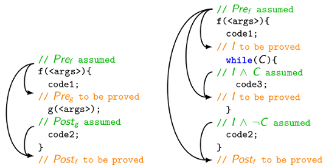
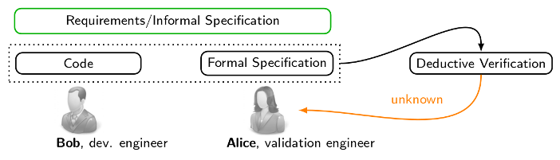

# Motivation

Among formal verification techniques, deductive verification consists in establishing a rigorous mathematical proof that a given program meets its specification. When no confusion is possible, one also says that deductive verification consists in "proving a program". It requires that the program comes with a formal specification, usually given in special comments called annotations, including function contracts (with pre- and postconditions) and loop contracts (with loop variants and invariants). The weakest precondition calculus proposed by Dijkstra reduces any deductive verification problem to establishing the validity of first-order formulas called verification conditions.

In modular deductive verification of a function `f` calling another function `g`, the roles of the pre- and postconditions of `f` and of the callee `g` are dual. The precondition of `f` is assumed and its postcondition must be proved, while at any call of `g` in `f`, the precondition of `g` must be proved before the call and its postcondition is assumed after the call. The situation for a function `f` with one call to `g` is presented in the figure below. An arrow in this figure informally indicates that its initial point provides a hypothesis for a proof of its final point. For instance, the precondition Pre`f` of `f` and the postcondition Post`g` of `g` provide hypotheses for a proof of the postcondition Post`f̀` of `f`. The called function `g` is proved separately.

One of the most important difficulties in deductive verification is the manual processing of proof failures by the verification engineer since proof failures may have several causes. Indeed, a failure to prove Pre`g̀` may be due to a non-compliance of the code to the specification: an error in the code `code1`, or a wrong specification Pre`f` or Pre`g` itself that may incorrectly formalize the requirements. The verification can also remain inconclusive because of a prover incapacity to finish a particular proof within an allocated time.

In many cases, it is extremely difficult for the verification engineer to decide how to proceed: either suspect a non-compliance and look for an error in the code or check the specification, or suspect a prover incapacity, give up automatic proof and try to achieve an interactive proof with a proof assistant (like [Coq](https://github.com/coq/coq)).

A failure to prove the postcondition Post`f` is even more complex to analyze: along with a prover incapacity or a non-compliance due to errors in the pieces of code `code1` and `code2` or an incorrect specification Pre`f` or Post`f`, the failure can also result from a too weak postcondition Post`g` of `g`, that does not fully express the intended behavior of `g`. Notice that in this last case, the proof of `g` can still be successful. The current automated tools for program proving do not provide a precise indication on the reason of the proof failure. The most advanced tools (like [Dafny](https://github.com/Microsoft/dafny)) produce a counterexample extracted from the underlying solver that cannot precisely indicate if the verification engineer should look for a non-compliance, or strengthen subcontracts (and which one of them), or consider adding additional lemmas or using interactive proof. So the verification engineer must basically consider all possible reasons one after another, maybe also trying a very costly interactive proof. For a loop, the situation is similar, and offers an additional challenge: to prove the invariant preservation, whose failure can be due to several reasons as well.

The motivation of this work is twofold. First, we want to provide the verification engineer with a more precise feedback indicating the reason of each proof failure. Second, we look for a counterexample that either confirms the non-compliance and demonstrates that the unproven predicate can indeed fail on a test datum, or confirms a subcontract weakness showing on a test datum which subcontract is insufficient.
